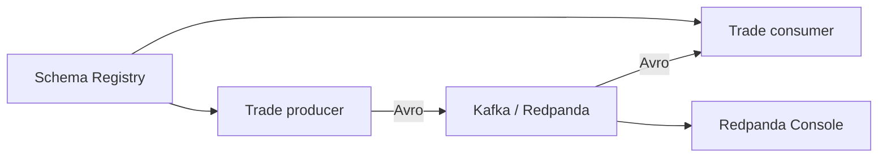

# Kafka Trading Lab

A production-shaped playground for learning Kafka by building a small trading
event platform. The repository is intentionally maintained through small,
reviewable pull requests, including pull requests proposed by Codex.

The goal is not a synthetic contribution graph. Every change must improve a
running system, add a test, document an engineering decision, or measure a
real behavior.

## What is implemented

- Redpanda broker with a Kafka-compatible API
- Schema Registry and Redpanda Console
- Versioned Avro `TradeExecuted` event
- Python producer and consumer using `confluent-kafka`
- Pydantic validation at the application boundary
- Unit tests, Ruff, mypy, and GitHub Actions CI
- A guarded local Codex runner that proposes one backlog item as a PR

## Architecture



## Quick start

Requirements: Docker, Docker Compose, and Python 3.12+.

```bash
cp .env.example .env
docker compose up -d
python -m venv .venv
source .venv/bin/activate
pip install -e ".[dev]"
python -m trading_lab.producer --count 20
```

In another terminal:

```bash
source .venv/bin/activate
python -m trading_lab.consumer
```

Open Redpanda Console at <http://localhost:8080>. The Schema Registry API is
available at <http://localhost:8081>.

Stop the local stack with:

```bash
docker compose down -v
```

## Development

```bash
ruff check .
ruff format --check .
mypy src
pytest
```

The next engineering tasks are in [BACKLOG.md](BACKLOG.md). Architecture
decisions belong in `docs/adr/`.

## Local autonomous development loop

The local runner uses Codex CLI authenticated through your ChatGPT
subscription. It does not require an OpenAI API key or API billing.

At 20:00 each weekday, macOS `launchd`:

1. reads `AGENTS.md` and `BACKLOG.md`;
2. implements exactly one small backlog item;
3. runs the repository quality gates;
4. commits the verified change on a `codex/daily-*` branch;
5. pushes the branch and opens a pull request through GitHub CLI.

It does **not** push directly to `main`, merge its own PR, edit its own workflow,
or invent empty commits. If it cannot produce a tested, useful change, it
produces no PR.

### One-time setup on macOS

Install and authenticate the required CLIs:

```bash
curl -fsSL https://chatgpt.com/codex/install.sh | sh
codex login
brew install gh
gh auth login
```

After this repository has an `origin` remote and a `main` branch:

```bash
./automation/install-launch-agent.sh
```

Test the complete loop without waiting for 20:00:

```bash
./automation/run-daily-agent.sh
```

The runner refuses to start with uncommitted changes, skips while an older
daily-agent PR is open, limits Codex to the repository workspace, and stops if
the agent edits its own instructions or guardrails. It never auto-merges.

Logs and the agent's final summaries are written to `.agent-logs/` and ignored
by Git.

## Suggested repository settings

- Public repository, if the code is intended as a portfolio project
- Protect `main`
- Require the `quality` status check
- Require one approving review
- Disable force pushes and branch deletion on `main`
- Keep auto-merge disabled for the first 10 agent PRs

## Honest portfolio framing

> I designed the architecture, backlog, quality gates, and agent guardrails for
> a Kafka trading lab. A scheduled coding agent implements scoped changes as
> tested pull requests, which I review and evolve.

That framing is both technically interesting and easy to verify from the
repository history.
