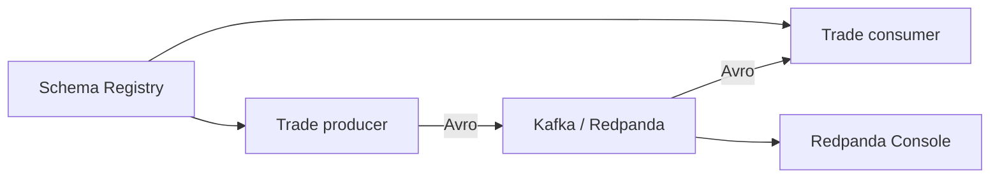

# Kafka Trading Lab

A production-shaped playground for learning Kafka by building a small trading
event platform. 


## What is implemented

- Redpanda broker with a Kafka-compatible API
- Schema Registry and Redpanda Console
- Versioned Avro `TradeExecuted` event
- Python producer and consumer using `confluent-kafka`
- Pydantic validation at the application boundary
- Unit tests, Ruff, mypy, and GitHub Actions CI
- A guarded local Codex runner that proposes one backlog item as a PR

## Architecture



## Quick start

Requirements: Docker, Docker Compose, and Python 3.12+.

```bash
cp .env.example .env
docker compose up -d
python -m venv .venv
source .venv/bin/activate
pip install -e ".[dev]"
python -m trading_lab.producer --count 20
```

In another terminal:

```bash
source .venv/bin/activate
python -m trading_lab.consumer
```

Open Redpanda Console at <http://localhost:8080>. The Schema Registry API is
available at <http://localhost:8081>.

Stop the local stack with:

```bash
docker compose down -v
```

## Development

```bash
ruff check .
ruff format --check .
mypy src
pytest
```

The next engineering tasks are in [BACKLOG.md](BACKLOG.md). Architecture
decisions belong in `docs/adr/`.
